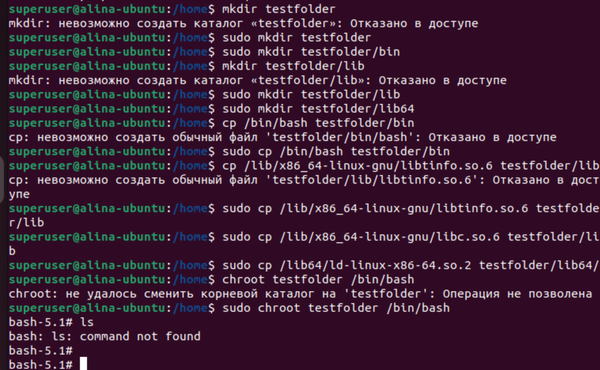
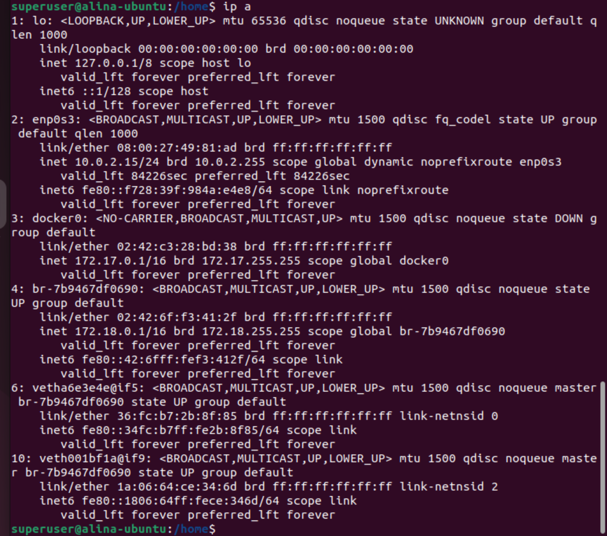
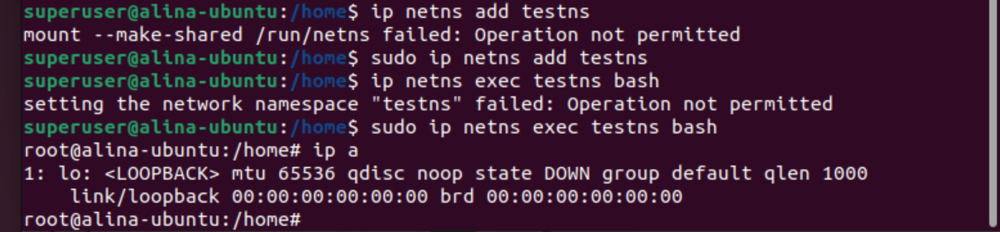
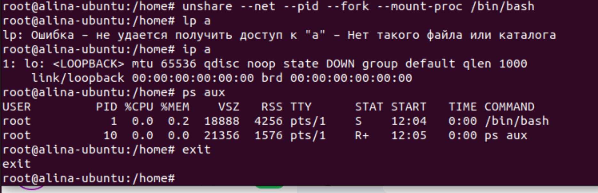

## Урок 1. Механизмы пространства имен
### Задание: необходимо продемонстрировать изоляцию одного и того же приложения (как решено на семинаре - командного интерпретатора) в различных пространствах имен.
- изменения корневой папки
  
- Просматр данных об интерфейсах сети на компьютере, включая информацию о их IP-адресах, состоянии и прочих характеристиках.
  
- Изоляция в сетевом пространстве имен.
  
- Разграничивание сетевого пространства имен, процессов, памяти, дерева процессов.
  