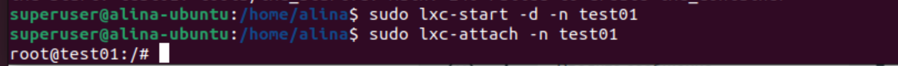

## Урок 2. Механизмы контрольных групп

Задание 1:
1) запустить контейнер с ubuntu, используя механизм LXC
2) ограничить контейнер 256 Мб ОЗУ и проверить, что ограничение работает
3) По желанию
4) добавить автозапуск контейнеру, перезагрузить ОС и убедиться, что контейнер действительно запустился самостоятельн
5) при создании указать файл, куда записывать логи
6) после перезагрузки проанализировать логи

### 1) запустить контейнер с ubuntu, используя механизм LXC
  - установка LXC и шаблонов:
  
  
  - создание и запуск контейнера
  
  
### 2) ограничить контейнер 256 Мб ОЗУ и проверить, что ограничение работает
   
   
  - перезагрузка контейнера
   
  - проверяем сработало ли ограничение
   

