## Урок 3. Введение в Docker

### 1 - устанавливаем Докер

- Обновляем списки пакетов:
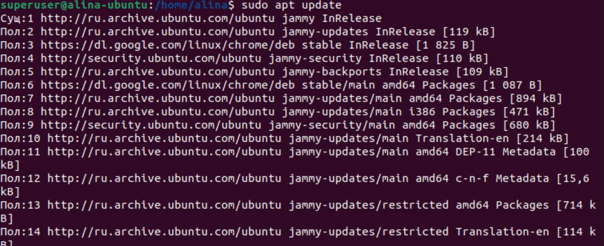

- Устанавливаем пакеты, которые позволят использовать репозиторий по HTTPS:
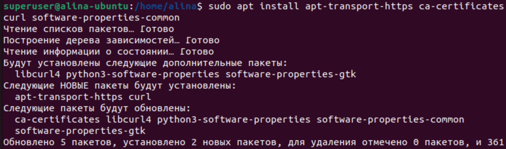

- Добавляем официальный GPG-ключ Docker:
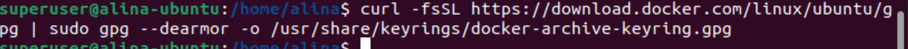

- Добавляем репозиторий Docker к списку источников пакетов:
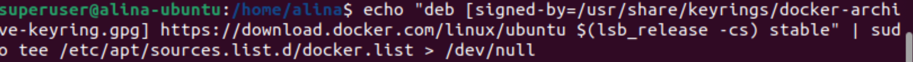

- Обновляем список пакетов, чтобы включить информацию о пакетах Docker из добавленного репозитория:
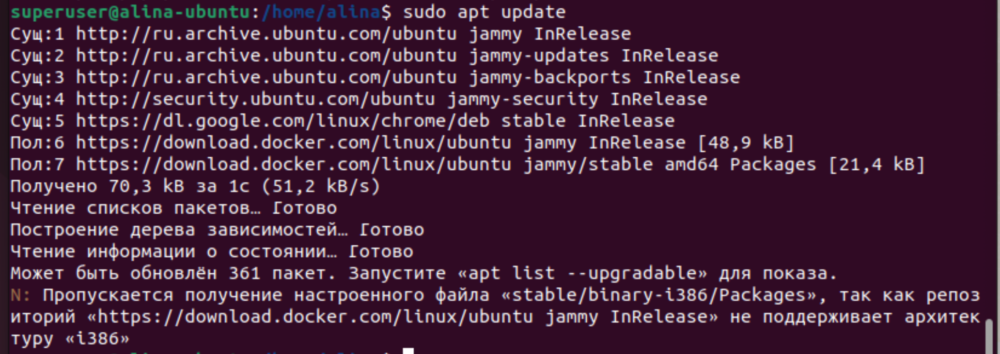

- Устанавливаем Docker:
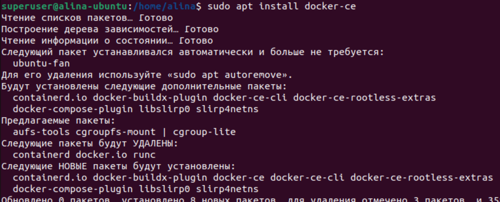

- Добавляем вашего пользователя в группу docker, чтобы избежать использования sudo для запуска Docker команд;
- Запускаем команду, чтобы применить изменения в текущем сеансе;
- Проверяем работу Docker:
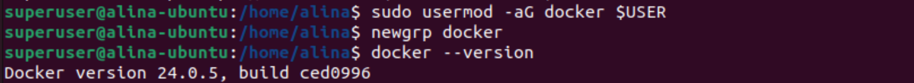

### 2 -тестируем.
- Проверяем установку и работу Docker следующими командами:
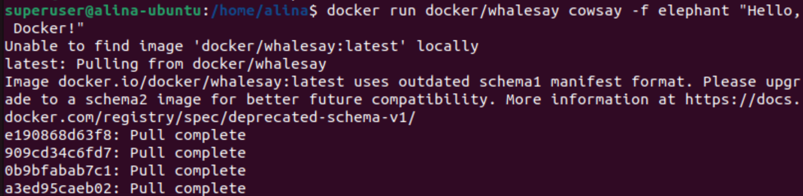
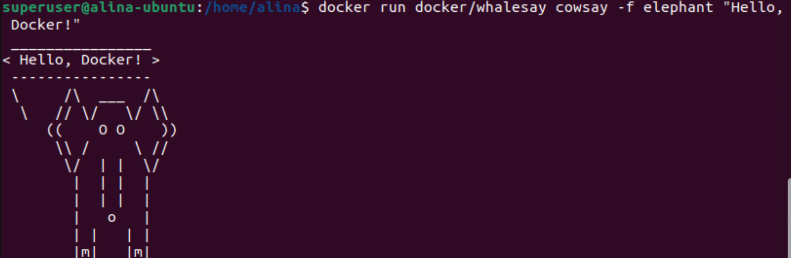
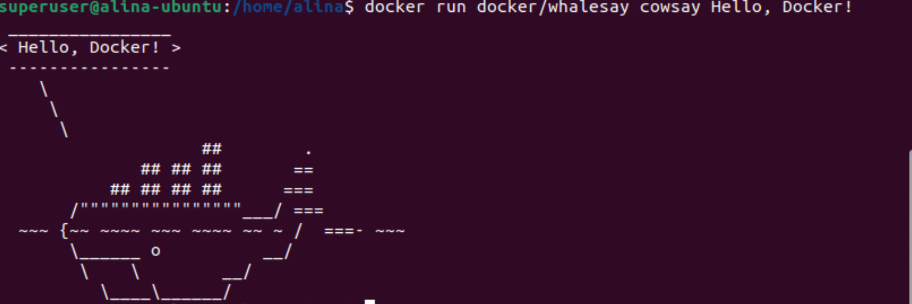
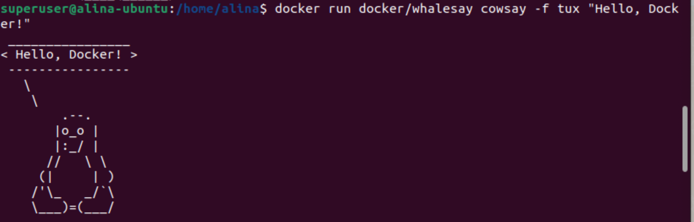
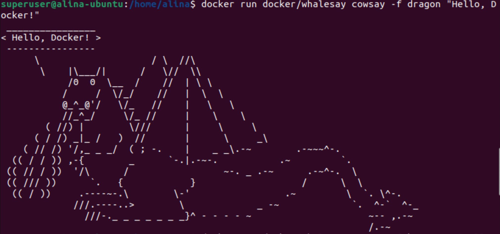
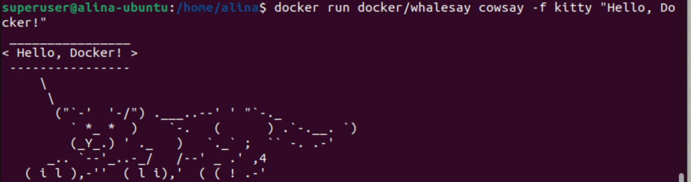

### 3 - тестируем команды.

- Создание и запуск контейнеров:
```
docker run: Запускает контейнер из образа.
docker start: Запускает остановленный контейнер.
docker stop: Останавливает работающий контейнер.
docker restart: Перезапускает контейнер.
docker exec: Выполняет команду внутри запущенного контейнера.
Управление контейнерами:
docker rm $(docker ps -aq): удалит все остановленные контейнеры
__

docker ps: Просмотр списка запущенных контейнеров.
docker ps -a: Просмотр списка всех контейнеров (включая остановленные).
docker rm: Удаляет контейнер.
docker logs: Просмотр логов контейнера.
Работа с образами:
__
docker images: Просмотр списка образов.
docker pull: Загрузка образа с Docker Hub.
docker build: Сборка образа из Dockerfile.
docker rmi: Удаляет образ.
```

### 4- Хранение данных в контейнерах Docker: Руководство с пояснениями
#### Часть-1

В данной методичке мы рассмотрим примеры хранения файлов в контейнерах Docker.
#### Задачи:

- Запустим контейнер из образа Ubuntu и войдем в него:
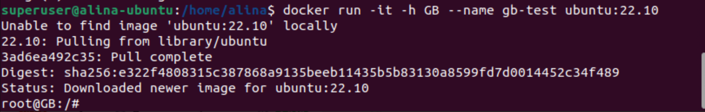

- Посмотрим содержимое корневой директории:
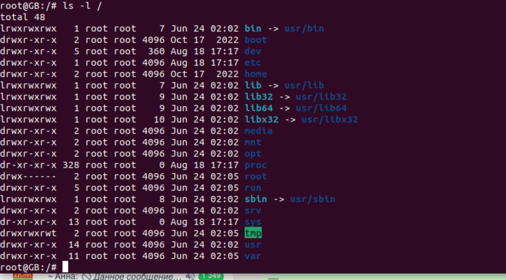
- Создадим новую директорию в корне и создадим файл "passwords.txt", и добавим в него какие-либо данные:
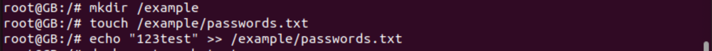

Мы создали директорию и файл внутри контейнера Ubuntu.

#### Задача:
- Остановим контейнер и запустим его снова.
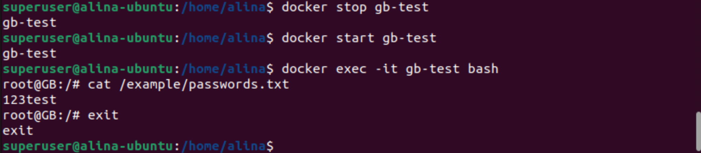

Наши данные сохранятся, так как мы не пересоздавали контейнер.

#### Задача:
- Удалим контейнер и создадим его заново:
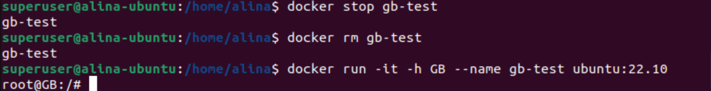

В этот раз наши данные будут утеряны, так как контейнер был удален.

#### Задача:
- Создадим директорию и подмонтируем ее к контейнеру:

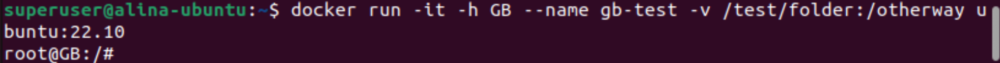

Мы создали директорию и подмонтировали ее в контейнер, что позволило нам сохранить данные.

#### Задача:
- Добавим данные в подмонтированную директорию:
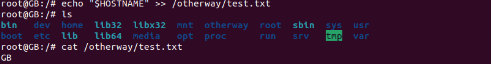


Мы добавили данные в подмонтированную директорию.

#### Задача:
- Проверим доступность данных с локальной системы:
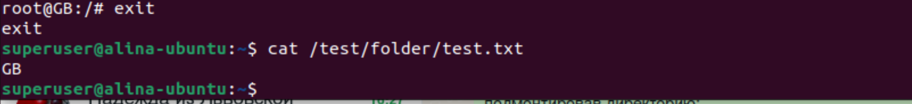

#### Задача:
- Удалим контейнер и создадим его снова, подмонтировав директорию:
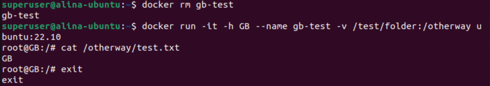

Мы видим, что данные по-прежнему доступны.

Заключение:
Самый надежный способ хранения данных в контейнерах - использование внешних хранилищ. Важно избегать хранения важных данных внутри контейнеров, чтобы предотвратить потерю информации.


#### Часть-2 Хранение данных в контейнерах Docker: Практическое руководство

#### Задачи:

- Создаем две папки с разным содержимым для будущего монтирования. Создаем контейнер из образа ubuntu:22.10.
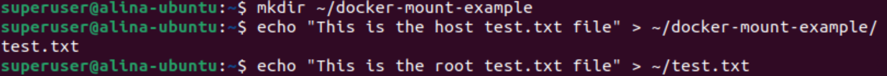
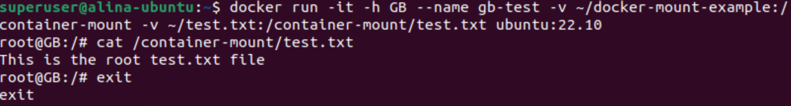

Мы создали контейнер и монтировали папку docker-mount-example внутрь контейнера. 
Затем мы монтировали файл test.txt из домашней директории внутрь этой папки в контейнере. 
При просмотре содержимого файла в контейнере, вы увидите данные из файла в домашней директории.
